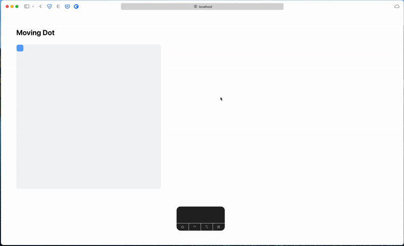

# Moving Dot

A simple reactor implemented using [grid-reactors](https://github.com/Eugleo/purescript-grid-reactors) in Purescript. When ran, the code produces the following interactive board:



This whole reactor is described by the following state:

```haskell
type Point = CoordinateSystem { x :: Number, y :: Number }

type World =
  { player :: Point
  , cursor :: Maybe Point
  , velocity :: { x :: Number, y :: Number }
  , paused :: Boolean
  }
```

The rest of the code can be seen in `src/Main.purs`.

## Running locally

Make sure you have `npm` and `git` installed. For example, on my system:

```
> node --version
v16.8.0
> npm --version
7.21.0
> git --version
git version 2.32.0
```

Then, clone this repository, install the dependencies, and start the server, by running

```
git clone https://github.com/Eugleo/purescript-reactor-example.git
cd purescript-reactor-example
npm install
npm run build
npm run serve
```

A browser window should open, with the example running. You can make changes to the code, and the version in the browser should update automatically.